# Context Engineering Framework for Next.js

**Supercharge your Claude Code experience with Context Engineering**

This repository provides a comprehensive framework for **Context Engineering** with an **AI Sub-Agent Architecture** - Instead of relying on clever prompts, we provide AI agents with comprehensive context, structured workflows, and automated quality gates to consistently deliver production-ready code.

## 📚 Table of Contents

- [🤖 AI Sub-Agent Architecture](#-ai-sub-agent-architecture)
- [🚀 Quick Start](#-quick-start)
  - [Installation](#installation)
  - [Installation Options](#installation-options)
  - [Post-Installation](#post-installation)
  - [Example Workflow](#example-workflow)
- [📁 Repository Structure](#-repository-structure)
- [🎯 Core Concepts](#-core-concepts)
  - [What is Context Engineering?](#what-is-context-engineering)
  - [Product Requirements Prompts (PRPs)](#product-requirements-prompts-prps)
- [🛠️ Commands Reference](#️-commands-reference)
  - [Commands Summary](#commands-summary)
  - [Core Workflow Commands](#core-workflow-commands)
  - [Quality Assurance Commands](#quality-assurance-commands)
  - [Utility Commands](#utility-commands)
  - [Project Creation Commands](#project-creation-commands)
- [🎣 Hooks System](#-hooks-system)
  - [Automated Quality Assurance](#automated-quality-assurance)
  - [Customizing Hooks](#customizing-hooks)
- [⚙️ Configuration](#️-configuration)
  - [Claude Permissions](#claude-permissions-claudesettingslocaljson)
  - [Customizing Configuration](#customizing-configuration)
- [📋 Templates](#-templates)
  - [PRP Base Template](#prp-base-template)
  - [Prompt Templates](#prompt-templates)
- [🔄 Best Practices](#-best-practices)
- [🚨 Troubleshooting](#-troubleshooting)
- [📚 Advanced Usage](#-advanced-usage)
  - [Multi-Agent Orchestration](#multi-agent-orchestration)
  - [Custom Validation Gates](#custom-validation-gates)
  - [Integration with CI/CD](#integration-with-cicd)
- [🎯 Philosophy](#-philosophy)

## 🤖 AI Sub-Agent Architecture

This framework leverages a **team of 22 specialized AI sub-agents** that work together to deliver production-quality code:

### 🎨 Design Agents (3)
- **ui-designer**: UI/UX design, component libraries, design systems
- **ux-researcher**: User research, journey mapping, usability testing
- **whimsy-injector**: Micro-interactions, delight engineering, personality injection

### ⚙️ Engineering Agents (9)
- **ai-engineer**: ML/AI features, LLM integration, recommendation systems
- **backend-architect**: API design, server architecture, microservices
- **database-architect**: Database design, query optimization, scaling
- **frontend-developer**: React/Vue/Angular, state management, performance
- **infrastructure-ops**: CI/CD, cloud infrastructure, monitoring
- **mobile-app-builder**: Native iOS/Android, React Native
- **nextjs-specialist**: Next.js 14+ expertise, App Router, Server Components
- **rapid-prototyper**: MVP development, quick prototyping
- **security-guardian**: Security audits, authentication, compliance
- **test-writer-fixer**: Test creation, maintenance, coverage

### 📊 Product Agents (3)
- **feedback-synthesizer**: User feedback analysis, insight extraction
- **sprint-prioritizer**: Sprint planning, feature prioritization
- **trend-researcher**: Market trends, viral opportunities

### 🎯 Project Management Agents (3)
- **experiment-tracker**: A/B testing, feature flags, experiment analysis
- **project-shipper**: Launch coordination, release management
- **studio-producer**: Cross-team coordination, resource allocation

### 🏢 Studio Operations Agents (4)
- **analytics-reporter**: Metrics analysis, performance reporting
- **finance-tracker**: Budget management, cost optimization
- **legal-compliance-checker**: Privacy policies, regulatory compliance
- **support-responder**: Customer support, documentation

**Key Benefits:**
- **Parallel Processing**: Multiple agents work simultaneously on different aspects
- **Specialized Expertise**: Each agent is optimized for specific domain knowledge
- **Quality Assurance**: Built-in collaboration and cross-validation
- **Scalable Architecture**: Agents spawn dynamically based on task complexity

## 🚀 Quick Start

### Installation

This framework can be installed into any existing Next.js project. The installation process will add the Context Engineering tools while respecting your existing project structure.

1. **Clone this repository:**
   ```bash
   git clone <repository-url>
   cd prps-agentic-eng-nextjs
   ```

2. **Run the installation script:**
   ```bash
   ./install.sh
   ```

3. **Follow the interactive installation process:**
   - Enter your target project directory
   - Choose how to handle file conflicts:
     - **Ask for each conflict** (recommended) - Review each file individually
     - **Skip all conflicts** - Keep your existing files unchanged
     - **Overwrite all conflicts** - Replace with framework files
   - Choose whether to add installed files to .gitignore:
     - **Recommended: Yes** - Prevents PRPS files from being committed to your repository
     - These files are specific to your local development environment

4. **What gets installed:**
   - `.claude/` directory with commands, hooks, and settings
   - `PROMPTS/` directory for prompt templates
   - `PRPs/` directory for Product Requirements Prompts
   - `CLAUDE.md` with Next.js specific guidelines
   - Example files and templates

### Installation Options

#### Interactive Installation (Default)
```bash
./install.sh
```
The script will guide you through the process and let you choose how to handle conflicts.

#### Non-Interactive Installation

For automated deployments, CI/CD, or when you want to skip all prompts:

**Option 1: Skip conflicts (preserve existing files)**
```bash
# This will install only new files and skip any that already exist
PRPS_TARGET_DIR=/path/to/your/nextjs/project ./install.sh --batch
```

**Option 2: Overwrite all conflicts**
```bash
# This will overwrite any existing files with the framework versions
PRPS_TARGET_DIR=/path/to/your/nextjs/project ./install.sh --overwrite-all
```

**Option 3: Add installed files to .gitignore**
```bash
# Use --add-to-gitignore flag to automatically add the installed files to .gitignore
# This prevents the PRPS files from being tracked in your repository
PRPS_TARGET_DIR=/path/to/your/nextjs/project ./install.sh --batch --add-to-gitignore

# Or in interactive mode
./install.sh --add-to-gitignore
```

**Environment Variables:**
- `PRPS_TARGET_DIR` - Required for non-interactive modes. Must be an absolute path to your target project.

**Command Line Flags:**
- `--batch` - Run in batch mode (skip all prompts, use defaults)
- `--overwrite-all` - Run in batch mode and overwrite all conflicting files
- `--add-to-gitignore` - Automatically add installed files to .gitignore
- `--help` - Show help message

**Examples:**
```bash
# Install to current directory, skip conflicts
PRPS_TARGET_DIR=$(pwd) ./install.sh --batch

# Install to specific project, overwrite everything
PRPS_TARGET_DIR=/home/user/my-nextjs-app ./install.sh --overwrite-all

# Install with gitignore update
PRPS_TARGET_DIR=$(pwd) ./install.sh --batch --add-to-gitignore

# View all available options
./install.sh --help
```

### Post-Installation

After installation, verify everything is working:

```bash
# Check that commands are available
ls .claude/commands/

# Verify hooks are executable
ls -la .claude/hooks/*.sh

# Review the settings
cat .claude/settings.local.json
```

### Example Workflow

```mermaid
graph TD
    A[💡 Feature Idea] --> B[📝 /generate-prp-prompt]
    B --> C[📋 /generate-prp]
    C --> D[⚡ /execute-prp]
    D --> E{🔍 Quality Gates}
    E -->|❌ Issues Found| F[🛠️ /check-errors]
    F --> G[🔒 /check-security]
    G --> H[📊 /check-api-database]
    H --> E
    E -->|✅ All Pass| I[🚀 Production Ready]
    
    style A fill:#e1f5fe
    style I fill:#e8f5e8
    style E fill:#fff3e0
    style F fill:#ffebee
    style G fill:#ffebee
    style H fill:#ffebee
```



Here's the complete workflow for implementing a new feature:

```bash
# 1. Generate a comprehensive prompt (optional - you can skip if you have a simple feature)
/generate-prp-prompt "create a user dashboard with real-time metrics and export functionality"

# 2. Generate detailed PRPs from your prompt or feature description
/generate-prp PROMPTS/dashboard_metrics.md

# 3. Execute the PRP to implement the feature
/execute-prp PRPs/dashboard_metrics_01.md

# 4. Check for and fix any errors
/check-errors

# 5. Security audit and remediation
/check-security

# 6. Optimize API calls and database queries
/check-api-database

# Pro tip: Use /clear between each command to manage Claude's context window
```

## 📁 Repository Structure

```
prps-agentic-eng-nextjs/
├── install.sh                    # Smart installation script
├── .claude/
│   ├── commands/                 # Custom Claude Code commands
│   │   ├── generate-prp-prompt.md    # Generate comprehensive prompts
│   │   ├── generate-prp.md           # Create implementation blueprints
│   │   ├── execute-prp.md            # Execute PRPs with quality gates
│   │   ├── check-errors.md           # Comprehensive error checking/fixing
│   │   ├── check-security.md         # Security audit and remediation
│   │   ├── check-api-database.md     # API/database optimization and cost reduction
│   │   ├── create-nextjs-project.md  # Initialize production-ready Next.js projects
│   │   └── create-vite-project.md    # Initialize production-ready Vite projects
│   ├── hooks/                    # Automated quality assurance
│   │   ├── smart-lint.sh            # Intelligent linting across languages
│   │   ├── ntfy-notifier.sh         # Push notifications
│   │   └── common-helpers.sh        # Shared utilities
│   ├── documents/                # Reference docs for prompts
│   └── settings.local.json       # Claude permissions and configuration
├── PROMPTS/                      # Generated and template prompts
│   ├── INITIAL.md               # Template for feature requests
│   └── INITIAL_EXAMPLE.md       # Example feature request
├── PRPs/                         # Product Requirements Prompts
│   ├── templates/
│   │   └── prp_base.md          # Base template for PRPs
│   └── EXAMPLE_multi_agent_dashboard_prp.md
├── examples/                     # Example implementations
└── CLAUDE.md                     # Next.js project guidelines
```

## 🎯 Core Concepts

### What is Context Engineering?

Context Engineering is a methodology that provides AI agents with comprehensive context instead of relying on clever prompts. It includes:

- **Complete codebase understanding** through research phases
- **Structured implementation blueprints** (PRPs)
- **Automated quality gates** with zero tolerance for errors
- **Parallel agent spawning** for complex problem-solving
- **Comprehensive validation loops** ensuring production readiness

### Product Requirements Prompts (PRPs)

PRPs are detailed implementation blueprints that contain:

- **Goal, Why, What** - Clear feature definition
- **Complete Context** - Codebase patterns, examples, documentation
- **Implementation Blueprint** - TypeScript types, component structure
- **Validation Gates** - Linting, testing, build requirements
- **Anti-patterns** - What to avoid

## 🛠️ Commands Reference

### Commands Summary

| Command | Purpose | Sub-Agents Used |
|---------|---------|-----------------|
| `/generate-prp-prompt` | Synthesize comprehensive prompts from feature descriptions | trend-researcher, ux-researcher |
| `/generate-prp` | Create implementation blueprints (PRPs) from prompts | backend-architect, ui-designer, database-architect |
| `/execute-prp` | Implement features with strict quality standards | frontend-developer, nextjs-specialist, backend-architect, test-writer-fixer, ui-designer, whimsy-injector, performance-tester |
| `/check-errors` | Fix all code quality issues (linting, TypeScript, tests) | test-writer-fixer, frontend-developer, nextjs-specialist, backend-architect, performance-tester |
| `/check-security` | Audit and fix security vulnerabilities | security-guardian, backend-architect, frontend-developer |
| `/check-api-database` | Optimize API calls and database queries | database-architect, backend-architect, performance-tester |
| `/update-project` | Generate/update PROJECT.md documentation | backend-architect, frontend-developer |
| `/create-nextjs-project` | Initialize a production-ready Next.js project | rapid-prototyper, nextjs-specialist, ui-designer, backend-architect |
| `/create-vite-project` | Initialize a production-ready Vite + React project | rapid-prototyper, frontend-developer, ui-designer, performance-tester |

### Core Workflow Commands

#### `/generate-prp-prompt <description>`
Synthesizes comprehensive prompts by combining templates with your feature description.

**Sub-Agents Used:**
- **trend-researcher**: Analyzes market trends and viral opportunities for feature validation
- **ux-researcher**: Provides user research insights and journey mapping context

**Features:**
- Combines templates with your specific requirements
- Includes relevant documentation links
- Adds context from existing codebase
- Structures requirements clearly

**Example:**
```bash
/generate-prp-prompt "user authentication system with social login"
```

**Output:** Creates `PROMPTS/auth_system.md` with complete context.

#### `/generate-prp <prompt-file>`
Generates multiple numbered PRPs from feature descriptions, breaking complex features into manageable, focused implementation chunks.

**Sub-Agents Used:**
- **backend-architect**: Designs API structure and data flow architecture
- **ui-designer**: Creates component hierarchy and design system integration
- **database-architect**: Plans data models and query optimization strategies

**Features:**
- One major item per PRP
- Dependency tracking between PRPs
- Confidence scoring for complexity
- Research-based codebase context

**Example:**
```bash
/generate-prp PROMPTS/auth_system.md
```

**Output:** Creates `PRPs/auth_system_01.md`, `PRPs/auth_system_02.md`, etc.

#### `/execute-prp <prp-file>`
Implements features from PRPs with strict quality standards and automated validation.

**Sub-Agents Used:**
- **frontend-developer**: React component implementation and optimization
- **nextjs-specialist**: Next.js 14+ App Router and Server Components
- **backend-architect**: API endpoints and server-side logic
- **test-writer-fixer**: Comprehensive test coverage and validation
- **ui-designer**: Design system compliance and accessibility
- **whimsy-injector**: Micro-interactions and delightful user experiences
- **performance-tester**: Load testing and optimization validation

**Mandatory Workflow:**
1. **Research Phase** - Analyze existing codebase patterns
2. **Planning Phase** - Design architecture and components
3. **Implementation** - Build with real-time validation
4. **Archive** - Move completed PRP to archive folder

**Quality Gates:**
- Zero ESLint warnings
- Zero TypeScript errors
- All tests must pass
- Build must succeed

**Example:**
```bash
/execute-prp PRPs/auth_system_01.md
```

### Quality Assurance Commands

#### `/check-errors`
Comprehensive code quality verification and fixing using parallel agents.

**Sub-Agents Used:**
- **test-writer-fixer**: Fixes failing tests and improves test coverage
- **frontend-developer**: Resolves ESLint issues and React warnings
- **nextjs-specialist**: Fixes Next.js-specific errors and optimizations
- **backend-architect**: Resolves TypeScript errors and API issues
- **performance-tester**: Addresses performance bottlenecks and optimizations

**Approach:** "FIXING task, not reporting task"
- Spawns multiple agents to fix different error types in parallel
- Zero tolerance for warnings or errors
- Re-runs checks until everything is green

**Coverage:**
- ESLint errors and warnings
- TypeScript type errors
- Test failures
- Build errors
- Import/export issues

**Example:**
```bash
/check-errors
```

**Output:** Fixes all errors and provides a clean codebase with zero issues.

#### `/check-security`
Security audit and vulnerability remediation using parallel fixing agents.

**Sub-Agents Used:**
- **security-guardian**: Comprehensive security audits and vulnerability assessment
- **backend-architect**: API security, authentication, and authorization fixes
- **frontend-developer**: XSS prevention, input validation, and client-side security

**Approach:** "FIXING task, not reporting task"
- Spawns multiple agents to fix security issues in parallel
- Zero tolerance for vulnerabilities
- Implements security best practices automatically

**Security Checks:**
- Exposed API keys/credentials
- Input validation vulnerabilities
- XSS/CSRF protection gaps
- Authentication/authorization issues
- Dependency vulnerabilities
- Next.js security best practices

**Example:**
```bash
/check-security
```

**Output:** Fixes all identified security issues and provides a summary.

#### `/check-api-database`
Comprehensive API and database optimization for performance and cost reduction.

**Sub-Agents Used:**
- **database-architect**: Query optimization, indexing strategies, and data modeling
- **backend-architect**: API design patterns, caching, and request optimization
- **performance-tester**: Load testing, benchmarking, and performance validation

**Approach:** "OPTIMIZATION task, not reporting task"
- Spawns multiple agents to optimize different inefficiencies in parallel
- Zero tolerance for redundant calls or slow queries
- Reads API documentation to understand best practices

**Optimization Coverage:**
- Duplicate API call consolidation
- N+1 query problem resolution
- Request batching and caching
- Database query optimization
- API cost reduction strategies
- Payload size minimization

**Example:**
```bash
/check-api-database
```

**Output:** Optimized code with reduced API calls and improved query performance.

### Utility Commands

#### `/update-project`
Generates or updates `PROJECT.md` with comprehensive project context including tech stack, architecture, and conventions.

**Sub-Agents Used:**
- **backend-architect**: Analyzes API patterns, data flow, and system architecture
- **frontend-developer**: Documents component patterns, state management, and UI conventions

**Features:**
- Auto-detects tech stack and dependencies
- Documents architecture patterns
- Captures coding conventions
- Maps project structure

**Example:**
```bash
/update-project
```

**Output:** Creates or updates `.claude/PROJECT.md` with current project state.

### Project Creation Commands

#### `/create-nextjs-project <description>`
Initialize a production-ready Next.js project from a vision, with zero compromises on quality.

**Sub-Agents Used:**
- **rapid-prototyper**: Quick project scaffolding and MVP development
- **nextjs-specialist**: Next.js 14+ setup, App Router configuration, and optimization
- **ui-designer**: Design system setup, component library integration
- **backend-architect**: API architecture planning and database integration

**Workflow:**
1. **Information Gathering** - Clarifies technical decisions (App Router vs Pages, auth needs, etc.)
2. **Architecture Planning** - Designs robust, scalable solution
3. **PRP Generation** - Creates 4-6 focused implementation PRPs
4. **Quality Enforcement** - TypeScript strict mode, ESLint, testing from day one

**Example:**
```bash
/create-nextjs-project "e-commerce platform with product catalog, cart, and checkout"
```

**Output:** 
- Comprehensive architecture document
- Multiple PRPs for systematic implementation
- Production-ready Next.js setup with all quality gates

#### `/create-vite-project <description>`
Initialize a production-ready Vite + React project with focus on performance and modern tooling.

**Sub-Agents Used:**
- **rapid-prototyper**: Fast project initialization and feature scaffolding
- **frontend-developer**: React setup, state management, and component architecture
- **ui-designer**: Design system integration and component library setup
- **performance-tester**: Bundle optimization, code splitting, and performance validation

**Workflow:**
1. **Framework Selection** - React, Vue, Preact, or Vanilla options
2. **Performance Planning** - Bundle optimization and code splitting strategies
3. **PRP Generation** - Creates 4-6 focused implementation PRPs
4. **Quality Standards** - Vitest, strict TypeScript, optimized builds

**Example:**
```bash
/create-vite-project "real-time collaborative whiteboard with drawing tools"
```

**Output:**
- Optimized Vite configuration
- Multiple PRPs for feature implementation
- Performance-focused setup with HMR and tree-shaking

## 🎣 Hooks System

### Automated Quality Assurance

The framework includes intelligent hooks that automatically maintain code quality:

#### `smart-lint.sh`
**Triggers:** After Write/Edit operations

**Features:**
- Auto-detects project type (Go, Python, JS/TS, Rust, Nix)
- Respects project Makefiles and package.json scripts
- Smart file filtering (only processes modified files)
- Zero tolerance - everything must be green

**Example Output:**
```
🔍 Style Check - Validating code formatting...
[INFO] Project type: nextjs
[INFO] Running: npm run lint
✅ All checks passed!
```

#### `ntfy-notifier.sh`
**Triggers:** Task completion or errors

**Features:**
- Push notifications to your devices
- Terminal context detection (tmux, Terminal, iTerm2)
- Rate limiting to prevent spam
- Configurable via YAML config

**Configuration Example:**
```yaml
# .claude/hooks/ntfy-config.yaml
server: https://ntfy.sh
topic: your-topic-name
enabled: true
```

### Customizing Hooks

Hooks are located in `.claude/hooks/` and can be customized:

```bash
# Edit the smart linter
vim .claude/hooks/smart-lint.sh

# Configure notifications
vim .claude/hooks/ntfy-notifier.sh
```

## ⚙️ Configuration

### Claude Permissions (`.claude/settings.local.json`)

The framework requires specific permissions to function properly:

```json
{
  "model": "opus",
  "toolPermissions": {
    "bash": {
      "allowedCommands": [
        "npm", "yarn", "pnpm", "bun",
        "git", "gh", "rg", "grep",
        "eslint", "prettier", "tsc",
        "pytest", "go", "cargo",
        "make", "chmod", "find"
      ]
    },
    "webfetch": {
      "allowedHosts": [
        "nextjs.org", "react.dev", "docs.github.com",
        "tailwindcss.com", "typescript.org"
      ]
    }
  },
  "hooks": {
    "postToolUse": {
      "write": [".claude/hooks/smart-lint.sh"],
      "edit": [".claude/hooks/smart-lint.sh"],
      "multiEdit": [".claude/hooks/smart-lint.sh"]
    }
  }
}
```

### Customizing Configuration

**Model Selection:**
- `opus` - Maximum quality for complex implementations
- `sonnet` - Balanced quality and speed
- `haiku` - Fast iterations and simple tasks

**Adding New Commands:**
Edit the `allowedCommands` array to include project-specific tools:

```json
"allowedCommands": [
  "npm", "yarn", "custom-build-tool"
]
```

**Web Fetch Permissions:**
Add documentation sites relevant to your project:

```json
"allowedHosts": [
  "nextjs.org", "your-docs-site.com"
]
```

## 📋 Templates

### PRP Base Template

Located in `PRPs/templates/prp_base.md`, this template provides the structure for all PRPs:

```markdown
# Feature Name PRP

## Goal
What this PRP accomplishes

## Why
Business/technical justification

## What
Detailed implementation requirements

## Context
- Codebase patterns
- Existing components
- Documentation links
- Dependencies

## Implementation Blueprint
- TypeScript interfaces
- Component structure
- File organization
- API design

## Validation Gates
- [ ] ESLint passes
- [ ] TypeScript compiles
- [ ] Tests pass
- [ ] Build succeeds
- [ ] Security audit clean

## Anti-patterns
What to avoid and why
```

### Prompt Templates

**`PROMPTS/INITIAL.md`** - Template for feature requests:
- Feature description
- Examples and references
- Documentation links
- Special considerations

**`PROMPTS/INITIAL_EXAMPLE.md`** - Example of a complete feature request with all necessary context.

## 🔄 Best Practices

### Context Management

**Use `/clear` between commands** to manage Claude's context window and ensure optimal performance.

### PRP Quality

**One major item per PRP** - Break complex features into focused, manageable chunks.

**Include comprehensive context:**
- Existing codebase patterns
- Relevant documentation
- Dependencies and constraints
- Examples and anti-patterns

### Validation Loops

**Zero tolerance for errors** - Everything must be perfect before proceeding:
- ESLint warnings = blocking
- TypeScript errors = blocking
- Test failures = blocking
- Build errors = blocking

### Security First

**Always run security checks** after implementing features:
- Input validation
- Authentication/authorization
- Dependency vulnerabilities
- Data exposure risks

## 🚨 Troubleshooting

### Installation Issues

**Script exits after Step 1:**
- This usually means you're trying to install into the same directory as the source
- Run the script from your project directory:

**Example:**
```bash
cd /your/project && /path/to/prps-agentic-eng-nextjs/install.sh
```

**"Please enter 1, 2, or 3" infinite loop:**
- This occurs when the script can't read input properly
- Try running with explicit options or ensure you're running in a proper terminal

**Examples:**
```bash
# Use batch mode to skip prompts
./install.sh --batch

# Or overwrite all conflicts
./install.sh --overwrite-all
```

**Permission denied errors:**
```bash
# Make sure the install script is executable
chmod +x install.sh

# If installing to a protected directory, use sudo (not recommended)
sudo ./install.sh
```

### Common Issues

**Command not found:**
```bash
# Ensure scripts are executable
chmod +x .claude/hooks/*.sh
```

**Linting failures:**
```bash
# Check project configuration
npm run lint
npm run type-check
```

**Permission errors:**
```bash
# Verify Claude permissions in settings.local.json
cat .claude/settings.local.json
```

### Hook Debugging

**Check hook execution:**
```bash
# Manually run hooks
.claude/hooks/smart-lint.sh
```

**View hook logs:**
```bash
# Check recent hook outputs
tail -f /tmp/claude-hooks.log
```


### Adding New Commands

1. Create a new `.md` file in `.claude/commands/`
2. Follow the existing command structure
3. Include comprehensive documentation
4. Test thoroughly before committing

**Example:**
```bash
# Create a new command file
touch .claude/commands/my-custom-command.md

# Edit with your preferred editor
vim .claude/commands/my-custom-command.md
```

### Improving Templates

1. Update templates in `PRPs/templates/`
2. Ensure backward compatibility
3. Document changes in commit messages
4. Provide migration guide if needed

### Hook Development

1. Add new hooks to `.claude/hooks/`
2. Follow the common helpers pattern
3. Include proper error handling
4. Update `settings.local.json` configuration

## 📚 Advanced Usage

### Multi-Agent Orchestration

The framework supports spawning multiple specialized agents for parallel problem-solving, with 22 different agent types optimized for specific domains.

**Example:**
```bash
# This command will spawn multiple agents to fix different error types
/check-errors
# Automatically invokes:
# - test-writer-fixer for test failures
# - frontend-developer for ESLint issues
# - nextjs-specialist for Next.js errors
# - backend-architect for TypeScript errors
# - performance-tester for optimization issues
```

**Agent Collaboration Features:**
- **Centralized Communication**: All agents collaborate through `.claude/collab/team_notes.md`
- **Context Sharing**: Agents read and append findings to prevent duplicate work
- **Specialized Expertise**: Each agent optimized for specific technical domains
- **Parallel Processing**: Multiple agents work simultaneously on independent tasks
- **Quality Cross-Validation**: Agents validate each other's work

**Benefits:**
- **10x Faster Resolution**: Parallel processing of complex issues
- **Domain Expertise**: Specialized knowledge for each technical area
- **Zero Context Loss**: Persistent collaboration and knowledge sharing
- **Scalable Architecture**: Agents spawn dynamically based on task complexity

### Custom Validation Gates

Add project-specific validation to PRPs:

```markdown
## Custom Validation Gates
- [ ] API contract tests pass
- [ ] Performance benchmarks meet SLA
- [ ] Accessibility audit scores 95+
- [ ] Bundle size under 250kb
```

### Integration with CI/CD

The framework's quality gates align perfectly with CI/CD pipelines:

```yaml
# .github/workflows/quality.yml
name: Quality Gates
on: [push, pull_request]
jobs:
  quality:
    runs-on: ubuntu-latest
    steps:
      - uses: actions/checkout@v3
      - name: Install dependencies
        run: npm ci
      - name: Lint
        run: npm run lint
      - name: Type check
        run: npm run type-check
      - name: Test
        run: npm run test
      - name: Build
        run: npm run build
```

## 🎯 Philosophy

This framework embodies the philosophy that **context beats cleverness**. Instead of trying to be clever with prompts, we provide comprehensive context that enables AI agents to consistently deliver production-ready code.

**Key Principles:**
- **Context Engineering > Prompt Engineering**
- **Multi-Agent Collaboration > Single Agent Limitations**
- **Specialized Expertise > General Purpose**
- **Validation Loops > Hope and Pray**
- **Parallel Processing > Sequential Bottlenecks**
- **Zero Tolerance > Good Enough**
- **Production Ready > Proof of Concept**

---
